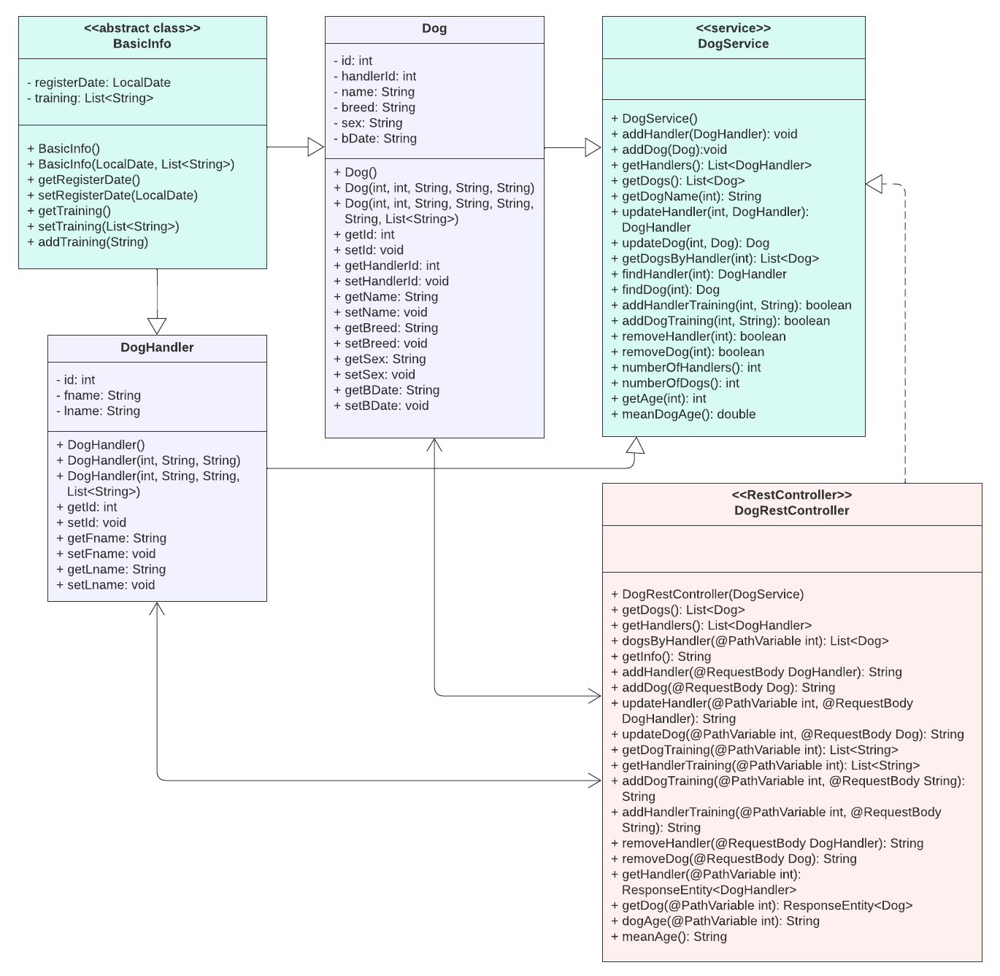

# Rekisteri pelastuskoirille ja niiden ohjaajille
IN00CT05-3004 Java-ohjelmointi, kevät 2023
Justiina Ronkainen, TVT22KMO

## Taustaa

Tähän rekisteriin voidaan tallentaa Oulun seudulla treenaavien pelastuskoirien ja niiden ohjaajien tiedot. Rekisteri on toteutettu Spring Boot-frameworkin avulla. Koodi on jaettu data-, rest- ja service-osioihin. Dataluokkia on kolme: BasicInfo on abstraktiluokka, Dog-luokan avulla tallennetaan koiran tiedot ja DogHandler on puolestaan koiranohjaajien tietoja varten. Rest-kansiossa on DogRestController, mihin on määritetty ohjelman käyttämät RESTful-palvelut. Service-kansiossa on DogService-luokka, mihin on koottu kaikki toiminnallisuudet.

## UML-luokkakaavio

Alla on ohjelman UML-luokkakaavio. Kuva ei välttämättä ole kaikkien sääntöjen mukainen, mutta siitä näkee luokkien väliset yhteydet.

  